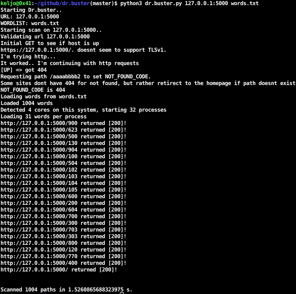

# dr.buster
Simple, yet effective web path finder implemented with multiprocessing in Python

### Module usage
To use it as module please rename dr.buster.py to dr_buster.py or something that wont be problematic to python interpreter
Then you can

```py
from dr_buster import start_scan

start_scan(url, wordlist_path)
```
You will have a report generated after program finishes and you can parse it easy cause url and code is in `url [code]` format

### CLI usage
```
$ python3 dr.buster.py https://example.com /home/user/wordlist.txt

starts scan on example.com with wordlist wordlist.txt
and generates report dr.buster.report.$datetime$
```

##### Example output when started with words.txt on testserver


##### Sample report
```
user@hostname:~/dr.buster$ cat dr.buster.report.09-08-2020_10-54-28 
http://localhost:5000/900 [200]
http://localhost:5000/623 [200]
http://localhost:5000/500 [200]
http://localhost:5000/130 [200]
http://localhost:5000/904 [200]
http://localhost:5000/100 [200]
http://localhost:5000/504 [200]
http://localhost:5000/102 [200]
http://localhost:5000/103 [200]
http://localhost:5000/104 [200]
http://localhost:5000/600 [200]
http://localhost:5000/105 [200]
http://localhost:5000/200 [200]
http://localhost:5000/604 [200]
http://localhost:5000/700 [200]
http://localhost:5000/300 [200]
http://localhost:5000/703 [200]
http://localhost:5000/303 [200]
http://localhost:5000/800 [200]
http://localhost:5000/120 [200]
http://localhost:5000/770 [200]
http://localhost:5000/400 [200]
```

### Test it out on testserver
```
$ pip3 install flask
$ export FLASK_APP=testserver.py
$ python3 -m flask run

and run dr.buster in another terminal
```

## TODO:
* [x] - add argsparse
* [x] - add support for dirbusting on specific path
* [ ] - create C++ version of dr.buster -> https://github.com/kelj0/dr_buster/tree/migration_to_cpp

##### DISCLAMER: I AM NOT RESPONSIBLE FOR ANY ACTIONS DONE WITH THIS SCRIPT, USE IT ONLY IF YOU HAVE PERMISSION

